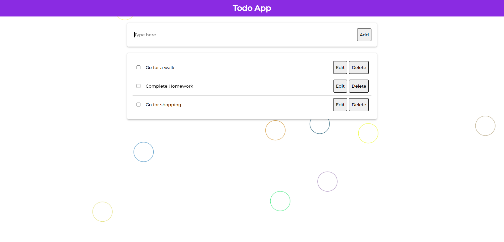

# flask-todo

Create project with virtual environment
```
mkdir myproject
cd myproject
py3 -m venv env
```
Activate it On Windows
```
env\Scripts\activate
```
Install Flask
```
pip install Flask
pip install Flask-SQLAlchemy
```
Set environment variables in terminal On Windows
```
set FLASK_APP=app.py
set FLASK_ENV=development
```
Run the app
```
$ flask run
```

1. Fetch data on load


2. Add Todo



3. Delete Todo


4. Edit Todo


